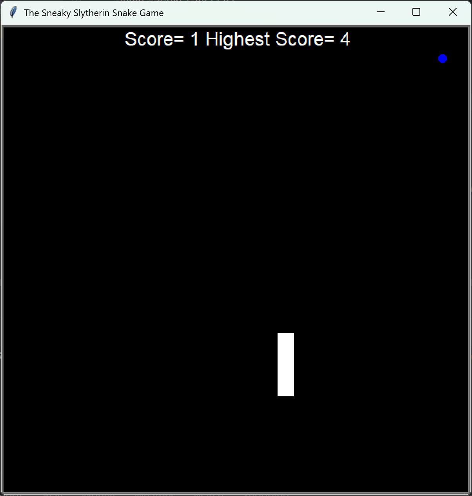

# 🐍Classic Snake Game Project | Day 20- 100 Days of Python

## A recreation of the classic *Snake* arcade game made using python and its *turtle* graphics library.<br><br> Only snake lovers are allowed to go further in the README
... nah, just kidding!

----
### 🎮**Features**
- A single player game
- Players can play as long as they want (unless they splash against the wall, of course)
- Snake can move  in all four directions (left/right/up/down)
- Snake cannot reverse direction in a single click
- Snake grows each time it eats... as it should
- Game ends if snake hits wall or itself
- Score is tallied each round
- High score gets stored in a text file
----
### 🎮**Controls**
- `⬆️` - Move Up
- `⬇️` - Move Down
- `➡️` - Move Right
- `⬅️` - Move Left

---
### ❓**How Is It Run**

1. Open a terminal  
2. Navigate to the project folder:
   ```bash
   git clone https://github.com/Kaustubh-forges/Pong-Arcade.git
   cd "Snake Game" 
   python snake_game.py
   ```
3. You can also run the code in an IDLE such as Visual Studio Code or PyCharm

### 💻 **Sneak Peek**


### 🙏 **Credits**
This project is part of my journey through the 
[100 Days of Code: Python Bootcamp](https://www.udemy.com/course/100-days-of-code/) by Dr. Angela Yu.  

The project idea and structure are based on the course.
The code itself reflects my own practice, understanding, and documentation.  

